# RiderLens Architecture, Infrastructure, and Video Storage Review

**Status date:** July 14, 2026  
**Purpose:** Code-audited description of the current RiderLens MVP, its infrastructure, its video lifecycle, and the recommended path to a reliable public product. This document is intended to be self-contained so it can be shared for an independent second opinion.

## 1. Executive Summary

RiderLens currently uses a **local-first mobile library with server-side analysis**:

1. The rider records or selects a source video.
2. The app lets the rider choose a 0.5 to 6 second analysis window.
3. The app copies the **entire source video** into its private document directory.
4. The app uploads the **entire source video plus the selected timestamps** directly to a Fly.io worker.
5. The worker normalizes the source, crops the selected window, runs MediaPipe Pose, renders a skeleton video and filmstrip, and returns everything in one large base64 JSON response.
6. The app writes the returned clean clip, skeleton clip, poster, filmstrip, and pose series to local files.

The most important clarification is:

> **Yes, RiderLens can send only the selected 6 second clip to the worker. It does not do that today.**

To send only the selected clip, the app must perform a real native video export after the user chooses the start and end points. The current trim UI stores timestamps only; it does not create a smaller file. Worker-side trimming cannot reduce upload size because the worker receives the full source before it can trim it.

### Recommended architecture

Use a **hybrid local-first architecture**:

- The original source stays in the rider's Photos/Gallery library.
- RiderLens exports a physical 0.5 to 6 second H.264 MP4 on-device.
- The selected clip becomes the local RiderLens record source.
- Only that selected clip is uploaded for analysis.
- Analysis becomes a durable asynchronous job using the already-provisioned Supabase tables and private bucket.
- Completed outputs are downloaded and cached locally for fast/offline playback.
- Permanent cloud backup of completed records is optional and can be added after the core paid product is stable.
- Full original videos are not backed up by default.

This separates two different questions:

1. **Does the analysis job need temporary server storage?** Recommended: yes, for reliability.
2. **Does RiderLens need to permanently back up every user's library now?** No. Local-first is acceptable for the first small release if the app clearly says records are stored on the device. Permanent sync should follow soon for paying users.

### Highest-priority risks before a broad paid launch

1. The public worker endpoints are currently unauthenticated and CORS allows all origins.
2. Analysis is one synchronous request with a five-minute client timeout.
3. One worker process accepts only one capture job at a time; overlapping jobs receive HTTP 429.
4. The full source is uploaded even though only up to 6 seconds are analyzed.
5. Large video and filmstrip data is returned as base64 inside JSON, creating network and memory overhead.
6. The free allowance is a local AsyncStorage counter and can be reset by reinstalling the app.
7. There is no active Supabase account, job, upload, or restore flow despite the schema being deployed.
8. App deletion or device loss can remove the private RiderLens library.

The recommendation is not to make the whole product cloud-first. The recommendation is to keep the user experience local-first while making **processing durable, authenticated, and bounded**.

## 2. Terminology

This document uses the following terms consistently:

| Term | Meaning |
|---|---|
| Source video | The video selected from Photos/Gallery or returned by the current camera flow. It may contain approach, several attempts, or unrelated footage. |
| Analysis window | The start/end timestamps selected by the rider. Current allowed length: 0.5 to 6 seconds. |
| Analysis clip | A physical MP4 containing only the selected window. The worker creates this today; the recommended app flow creates it on-device before upload. |
| Clean clip | The selected clip without overlays. |
| Skeleton clip | The selected clip with pose skeleton, RiderLens watermark, and share treatment. |
| Record | Local metadata plus clean clip, skeleton clip, poster, pose series, filmstrip, tags, and status. |
| Transient server media | Files kept only long enough to complete/retry an analysis job. |
| Cloud backup | A durable remote copy intended to restore a user's library on another device. This is different from transient processing storage. |

## 3. Current Product Scope

### Implemented product direction

- MTB gravity first, not a general sports platform.
- A rider selects one filmed moment and receives a studyable/shareable record.
- The primary UI is a record library with a single add action.
- The rider selects the jump manually. Full-video automatic jump search is not in the active mobile path.
- A centered 4 second window is proposed initially.
- The rider may select between 0.5 and 6 seconds.
- A clean-video lens and skeleton lens are available.
- Records have local tags and can be shared or deleted.
- Pending records retry when the worker becomes reachable.
- External YouTube/web links are not part of the MVP.
- Garage and Tools code remains in the repository but is intentionally unrouted from the v1 product.

### Important scope distinction

The active `/capture/record` product endpoint performs pose capture and rendering. It currently calls the measurement pipeline with `include_bike=False`. Therefore:

- MediaPipe rider pose is active.
- Skeleton frames and body curves are active.
- The worker contains experimental bike/floor/tire geometry code and an object detector, but the active record route does not use that bike geometry.
- Claude/Anthropic review and coaching code exists for the development Analysis Lab, but the active record route does not call it.
- The current v1 should be described as visual analysis/presentation, not authoritative automated coaching.

### Current input choices

The app currently shows both:

- **Record video** using `expo-image-picker`'s system camera flow.
- **Pick from library** using the system photo/video picker.

Removing the in-app camera and relying only on Photos/Gallery has been discussed, but it is **not implemented** at the status date of this document.

## 4. Current Technology Stack

### 4.1 Mobile app

| Area | Current implementation |
|---|---|
| Framework | Expo SDK `~54.0.0` |
| UI runtime | React `^19.1.0`, React Native `^0.81.5` |
| Language | TypeScript `~5.9.2` |
| Native architecture | React Native New Architecture enabled |
| Video selection/camera | `expo-image-picker` |
| Video playback | `expo-video` |
| Thumbnail generation | `expo-video-thumbnails` |
| Local files | `expo-file-system`, currently using the legacy API surface |
| Local structured state | AsyncStorage |
| Orientation | `expo-screen-orientation` |
| Sharing | React Native Share and `expo-sharing` |
| Icons/graphics | Lucide React Native and `react-native-svg` |
| Billing | RevenueCat via `react-native-purchases` and `react-native-purchases-ui` `^10.4.1` |
| Backend client | `@supabase/supabase-js`, initialized but not used in the active record flow |
| Fonts | IBM Plex Sans, IBM Plex Mono, Bebas Neue |
| Tests | Vitest for TypeScript units |

### 4.2 Mobile identifiers and builds

| Platform | Current identifier |
|---|---|
| iOS bundle identifier | `app.riderlens.mvp` |
| Android application ID | `com.riderlens.app` |
| App version | `0.1.0` |
| Build service | Expo Application Services (EAS) |
| EAS project ID | Configured in `app.json` |
| Production worker URL | `https://riderlens-worker.fly.dev` |

The `mvp` segment in the iOS bundle identifier is an internal identifier and is not shown as the customer-facing app name. It cannot be changed for an already-created App Store app without creating a different app identity.

### 4.3 Python analysis worker

| Area | Current implementation |
|---|---|
| API | FastAPI `0.116.2` |
| Server | Uvicorn `0.35.0` |
| Runtime | Python 3.12 slim container |
| Pose | MediaPipe `0.10.21` |
| Image/video processing | OpenCV headless `4.10.0.84` |
| Numeric operations | NumPy `1.26.4` |
| Video trim/normalization/encoding | FFmpeg installed in the container |
| Optional AI review | Anthropic Python SDK; used by development/review paths, not required by the active capture record path |
| Optional database client | Supabase Python client `2.17.0` |
| QR generation | Segno `1.6.6` |
| Tests | Pytest suite |

### 4.4 Worker deployment

| Item | Current configuration |
|---|---|
| Host | Fly.io |
| App | `riderlens-worker` |
| Primary region | `cdg` (Paris) |
| Machine | `shared-cpu-8x`, 4096 MB RAM |
| Internal port | 8080 |
| TLS | Forced HTTPS |
| Scale behavior | Auto-start, auto-stop, minimum running machines `0` |
| Health check | `/health`, 60 second interval, 15 second timeout, 30 second grace period |
| Production dev UI | Disabled with `RIDERLENS_DEV_UI=0` |
| Capture concurrency | One active `/capture/record` job per machine |

Scale-to-zero reduces idle cost but creates cold starts. The mobile app prewarms `/health` when the add action opens and allows up to 30 seconds for the Fly health check.

### 4.5 Supabase foundation

The Supabase project and first migration exist and were pushed successfully. The project contains:

- Supabase Auth support at the client-library level.
- `profiles` table.
- `analysis_sessions` table.
- `analysis_jobs` table.
- Private `analysis-media` Storage bucket.
- Owner-only row-level security for reads.
- A restricted source-upload policy.
- Object-key fields for source, clean clip, skeleton clip, poster, analysis JSON, and frames.
- Job attempts, availability, locks, leases, worker ID, progress, and errors.

This is **provisioned infrastructure, not an active application flow**. The current app creates a Supabase client when environment variables exist, but it does not sign in, create session rows, upload media, monitor remote jobs, or restore records.

### 4.6 RevenueCat foundation

The code currently:

- Configures a platform-specific RevenueCat public SDK key in native builds.
- Uses entitlement ID `RiderLens Pro` unless overridden by an environment variable.
- Presents the RevenueCat paywall when the free allowance is exhausted.
- Restores purchases.
- Listens for entitlement changes.
- Hides native billing integration in Expo Go, where the native module is unavailable.

The free allowance is currently **three analyses total**, tracked in AsyncStorage on the device. Store prices are not hardcoded in the app; the store/RevenueCat offering supplies localized prices. Any prices written in older planning files should be considered proposals, not the source of truth.

The dashboard configuration reported during setup is:

| Item | Reported configuration |
|---|---|
| Entitlement | `RiderLens Pro` |
| Offering | `default` |
| RevenueCat packages | `$rc_monthly` and `$rc_annual` |
| Apple products | `com.riderlens.app.pro.monthly` and `com.riderlens.app.pro.annual` |
| Google subscription | `riderlens_pro_v1` |
| Google base plans | `monthly` and `annual` |

These values live in the stores/RevenueCat rather than the repository and should be rechecked before release. Apple in-app product IDs do not need to share the iOS bundle identifier's prefix; RevenueCat's Apple app configuration itself must still point to the actual bundle identifier, `app.riderlens.mvp`.

## 5. Current Architecture

```mermaid
flowchart LR
    A["System camera or Photos/Gallery"] --> B["Expo Image Picker"]
    B --> C["Trim UI stores start/end timestamps"]
    C --> D["Copy entire source into app documents"]
    D --> E["POST entire source + timestamps"]
    E --> F["Fly.io FastAPI worker"]
    F --> G["Normalize entire source with FFmpeg"]
    G --> H["Analyze selected 0.5-6 second window"]
    H --> I["Return base64 clean clip + skeleton clip + filmstrip + series"]
    I --> J["Write local record files"]
    J --> K["Library, offline playback, share"]

    L["Supabase tables and private bucket"] -. "provisioned but not connected" .-> D
    L -. "provisioned but not connected" .-> F
```



### Current request model

The active mobile request is:

```text
POST /capture/record
multipart/form-data:
  video=<entire source file>
  start_seconds=<selected start>
  end_seconds=<selected end>
  rotate_degrees=<0|90|180|270>
```

The response is one JSON document containing:

```text
clip:          base64 MP4 data URL
skeletonClip:  base64 MP4 data URL or null
window:        selected start/end
series:        pose time-series JSON
filmstrip:     array of base64 JPEG data URLs
events:        optional event metadata
flight:        optional estimated airtime/height metadata
```

The client keeps its five-minute timeout active through response-body transfer and JSON parsing.

## 6. Current Video Lifecycle

### 6.1 Selection

#### Camera path

- Uses the system camera through `expo-image-picker`.
- Requests camera permission.
- Sets `videoMaxDuration: 30`.
- Uses high-quality output, with a code comment targeting approximately 1080p on iOS.
- The returned asset is passed to RiderLens's custom selection UI.

#### Library path

- Requests photo-library permission.
- Does not use the system edit UI.
- Rejects videos longer than 30 seconds.
- On iOS, requests the `H264_1920x1080` export preset before RiderLens receives the asset.
- Android ignores that iOS-specific export preset and relies on worker normalization.

### 6.2 Selection window

| Setting | Current value |
|---|---:|
| Minimum selection | 0.5 seconds |
| Default selection | 4 seconds, centered in the source |
| Maximum selection | 6 seconds |

The selection controls modify timestamps only. No local MP4 is cut at this point.

### 6.3 Local source persistence

On confirmation, the app copies the full selected source to:

```text
<app-document-directory>/riderlens/videos/clip-<generated-id>.<extension>
```

This private copy is one-to-one with the record. Deleting the record deletes that source copy. The app never deletes a file in Photos/Gallery.

### 6.4 Worker ingest

The worker:

1. Writes the uploaded source to a temporary capture directory.
2. Normalizes rotation metadata into upright pixels.
3. Transcodes to H.264/AAC and caps oversized footage to approximately 1080p-class dimensions.
4. Marks the upload as eligible for cleanup after 45 minutes for possible retry/reuse. Cleanup is triggered when a later upload is saved; there is no independent scheduled temp-file cleanup yet.
5. Analyzes only the selected 0.5 to 6 second window.
6. Creates the clean selected clip.
7. Creates the skeleton/watermarked clip.
8. Returns all outputs in one JSON response.

The expensive normalization applies to the **entire uploaded source**, not only the selected window. This is one reason longer source videos should not be accepted until the app exports the selected clip locally.

### 6.5 Local completed-record persistence

The app stores:

```text
<app-document-directory>/riderlens/records/index.json
<app-document-directory>/riderlens/records/<record-id>/clip.mp4
<app-document-directory>/riderlens/records/<record-id>/skeleton.mp4
<app-document-directory>/riderlens/records/<record-id>/detail.json
<app-document-directory>/riderlens/records/<record-id>/poster.jpg
```

`index.json` contains lightweight record metadata. `detail.json` contains the pose series and the complete filmstrip, including base64-encoded images.

### 6.6 Deletion

Deleting a current local record removes:

- The private source copy in `riderlens/videos`.
- The record's output directory.
- The record metadata from the local index.

There is no remote deletion because the active flow has no remote record.

## 7. Current Limits and Boundaries

| Boundary | Current value | Enforcement location |
|---|---:|---|
| Camera source duration | 30 seconds | Image picker camera option |
| Library source duration | Less than or equal to 30 seconds | Mobile app after picking |
| Source byte-size limit | None in app code | Not explicitly enforced |
| Analysis window minimum | 0.5 seconds | Mobile selection logic |
| Analysis window default | 4 seconds | Mobile selection logic |
| Analysis window maximum | 6 seconds | Mobile logic and worker validation |
| Worker temporary upload TTL | 45 minutes; best-effort cleanup runs on a later upload | Worker temp cleanup |
| Client record request timeout | 300 seconds | Mobile fetch abort controller |
| Local health timeout | 4 seconds | Mobile worker resolution |
| Fly cold-start health timeout | 30 seconds | Mobile worker resolution |
| Worker capture concurrency | 1 job per machine | Non-blocking process lock |
| Busy response | HTTP 429, `Retry-After: 30` | Worker |
| Supabase object maximum | 512 MiB per object | Storage bucket migration |
| Free analysis allowance | 3 | Local AsyncStorage |
| Local session count | No hard limit | Device storage is the practical limit |

The Supabase 512 MiB value is a **configured maximum per object**, not the expected size of a RiderLens video and not evidence that each video consumes 512 MiB.

## 8. Current Offline Behavior

### Works offline

- Existing ready records play from local files.
- Tags and local metadata work.
- A selected source is copied into the app library before analysis.
- A failed/unreachable analysis remains as a pending record.
- Closing and reopening the app converts an interrupted `processing` record back to `pending`.

### Requires connectivity

- MediaPipe analysis in the current product architecture.
- Clean/skeleton output generation.
- RevenueCat purchase and entitlement refresh.
- Any future Supabase sync.

### Retry behavior

The app probes and retries pending/failed records:

- On initial hydration.
- When the app becomes active.
- Every 30 seconds while the app is active.
- When the rider manually retries/pulls to refresh.

This is **foreground retry**, not a true OS background upload/processing task. iOS or Android may suspend the app, so RiderLens cannot promise processing while the app remains closed.

## 9. Current Storage and Memory Cost

### 9.1 Why a 5 MB source can become a much larger record

One compressed source video is not the only persisted asset. A completed record currently may contain:

1. A full private copy of the source video.
2. A clean selected-window MP4.
3. A second skeleton/watermarked MP4.
4. A poster JPEG.
5. A JSON file containing every filmstrip image as base64.
6. Pose series and metadata.

Base64 also adds roughly one third to the encoded byte count before HTTP compression. GZip reduces network transfer, but the mobile client still has to parse the expanded JSON strings and decode/write the media. At peak, React Native may hold the response string, parsed JSON, base64 strings, and decoded files close together in memory.

### 9.2 Observed development sample

One previously inspected approximately 3 second simulator record used roughly:

| Asset | Approximate size |
|---|---:|
| Clean clip | 1.7 MB |
| Skeleton clip | 1.8 MB |
| `detail.json` with base64 filmstrip | 6.7 MB |
| Total outputs, excluding full source | About 10 MB |

This is one sample, not a guaranteed average. It demonstrates that the older planning target of 2 to 5 MB per record is not achieved by the current output structure.

### 9.3 Useful bitrate estimates

Approximate compressed video size can be estimated as:

```text
size in MB = bitrate in megabits/second x duration in seconds / 8
```

Examples before container overhead:

| Video | 8 Mbps | 20 Mbps | 50 Mbps |
|---|---:|---:|---:|
| 6 seconds | 6 MB | 15 MB | 37.5 MB |
| 30 seconds | 30 MB | 75 MB | 187.5 MB |
| 5 minutes | 300 MB | 750 MB | 1.875 GB |

Phone 4K/high-frame-rate files can exceed these examples. File size cannot be controlled reliably by duration alone.

### 9.4 Current per-record growth

With the full source retained, a current record can reasonably occupy tens or hundreds of megabytes depending on source bitrate. A rough practical range is:

```text
full source copy + 10-35 MB of generated outputs
```

One hundred records could therefore consume several gigabytes. This is why the product should retain the selected moment, not duplicate the full source indefinitely.

## 10. Supabase: What Exists and What Is Missing

### 10.1 Existing schema strengths

The first migration establishes a good foundation:

- User-owned sessions.
- Durable job states.
- Maximum attempts.
- Queue availability time.
- Lock and lease fields.
- Error codes/messages.
- Private storage.
- Owner-only reads.
- A strict `<user-id>/<session-id>/<asset-name>` key convention.
- Generated-asset keys separated from source keys.
- The service secret remains server-side.

### 10.2 Deliberate client restrictions

Authenticated clients can read their own sessions/jobs, but they do not currently receive general insert/update/delete rights. The source upload policy only allows `source.mp4` or `source.mov` for a server-approved session in an upload state.

That means a trusted server API or security-definer RPC must create/authorize a session before the client can upload. This is appropriate; the app should not be able to grant itself paid jobs or arbitrary object paths.

### 10.3 Missing pieces for an active job architecture

- Mobile authentication/sign-in.
- A trusted `create analysis session` endpoint or RPC.
- Entitlement/quota validation at session creation.
- A finalized upload handshake.
- An atomic job-claim function, ideally using row locking and `SKIP LOCKED` semantics.
- A worker loop or wake mechanism that claims queued jobs.
- Worker download of the source object.
- Worker upload of clean/skeleton/poster/analysis assets.
- Progress/status polling or Realtime subscription in the app.
- Signed download URLs and local caching.
- Cleanup/retention jobs.
- Account deletion and export.

The current `/jobs/{job_id}/analyze` route only accepts a local filesystem path. It updates Supabase status rows when configured, but it does not download from Storage or upload results. It is a scaffold, not the final remote job worker.

## 11. RevenueCat and Access Control

### Current behavior

- Three free analyses are allowed on the device.
- A Pro entitlement removes that client-side gate.
- The RevenueCat paywall is used in native builds.
- Restore purchases is implemented.
- Expo Go cannot test the native purchase SDK.

### Public-launch limitations

- The free-use counter is local and can be reset by deleting/reinstalling the app.
- The worker does not verify a RevenueCat entitlement.
- The worker does not identify the user.
- There is no server quota, rate limit, or cost control per account.
- RevenueCat's anonymous app user ID is not currently aligned with a Supabase user ID.

### Recommendation

When Supabase Auth is activated:

1. Use the Supabase user UUID as the stable RevenueCat app user ID through `Purchases.logIn(...)`.
2. Validate entitlement or a server-maintained allowance before creating an analysis session.
3. Count free analyses server-side.
4. Keep RevenueCat as the purchase/entitlement source, but do not trust only the client to authorize worker cost.
5. Preserve restore purchases and account-linking behavior.

## 12. Architecture Options

| Option | Description | Advantages | Disadvantages | Recommendation |
|---|---|---|---|---|
| A. Current direct worker | Local files, full source sent directly, large synchronous response | Already works; few components | Fragile request, no auth, full upload, memory-heavy, no durable server job | Closed testing only |
| B. Fully local/on-device | Local trim and MediaPipe/native rendering on phone | True offline, no upload/privacy cost | Significant native work, device variability, thermal/battery cost, larger app, harder model updates | Long-term experiment, not immediate MVP |
| C. Cloud-first library | Every source/output lives remotely and streams to app | Easy cross-device restore | Poor trail/offline UX, upload dependency, egress/storage cost, privacy burden | Do not use as primary UX |
| D. Local-first plus transient async jobs | Selected clip local, temporary private upload, durable job, outputs cached locally | Reliable processing, bounded upload, good offline playback, lower storage | Requires auth/job orchestration | **Recommended next architecture** |
| E. Local-first plus permanent record backup | Option D plus durable cloud copies of completed records | Device-loss recovery, cross-device library, share links | More retention/deletion/privacy work | Add after D; recommended soon for paying users |

## 13. Recommended Target Architecture

```mermaid
flowchart LR
    A["Photos/Gallery source"] --> B["Rider chooses 0.5-6 second window"]
    B --> C["Native on-device MP4 export"]
    C --> D["Local selected clip"]
    D --> E["Create authorized session/job"]
    E --> F["Upload selected clip to private transient storage"]
    F --> G["Durable queued job"]
    G --> H["Fly worker claims job"]
    H --> I["MediaPipe + FFmpeg"]
    I --> J["Upload clean, skeleton, poster, analysis JSON"]
    J --> K["Job completed"]
    K --> L["App downloads and caches outputs locally"]
    L --> M["Offline library and sharing"]

    J -. "optional later" .-> N["Permanent cloud record backup"]
    F -. "delete after completion/retention window" .-> O["Transient source cleanup"]
```



### Recommended request/job sequence

1. Rider picks a source from Photos/Gallery.
2. Rider selects the analysis window locally.
3. App exports a physical selected clip.
4. App stores the selected clip locally and creates a pending record immediately.
5. App calls a trusted endpoint to create an authorized session/job.
6. Server checks user, entitlement/free quota, requested duration, and current limits.
7. App uploads only the selected clip to a private object key.
8. App finalizes the upload; the job becomes queued.
9. Worker atomically claims the job and sets a lease.
10. Worker downloads the selected clip and processes it.
11. Worker writes outputs as separate objects, not base64 fields in one response.
12. Worker marks the job completed.
13. App polls while active or subscribes to status, downloads outputs, and caches them locally.
14. If the app closes, server processing continues and the result is available on reopen.
15. Source is deleted from transient server storage after a retention window.

### Small-scale queue operation on Fly

For the first paid cohort, one worker is enough if the queue is durable:

- The job row is the source of truth.
- A short wake request can start the scale-to-zero Fly machine.
- The worker claims one job at a time.
- A scheduled sweeper or recurring wake retries queued jobs and expired leases.
- A crash returns the job to the queue after its lease expires.
- The client never needs to keep a five-minute HTTP request alive.

If queue polling must be continuous, set one minimum Fly machine instead of zero. That raises predictable idle cost but simplifies reliability. This decision should be based on measured daily jobs and acceptable processing latency.

## 14. Physical On-Device Trimming

### Why it is required

Without local export, allowing a five-minute source means:

- The app may copy a multi-hundred-megabyte or multi-gigabyte source.
- iOS may transcode the whole source during picking.
- The app uploads the whole source.
- The worker normalizes the whole source.
- A network interruption wastes the whole upload.

The selected timestamps do not prevent any of those costs.

### Candidate approaches

#### Option 1: Native trim library

Evaluate `react-native-video-trim` as the first implementation spike. The desired capability is a headless trim/export function using start/end milliseconds and returning a local output path.

Requirements for acceptance:

- Works with Expo SDK 54 through a development/native build.
- Works with React Native New Architecture.
- Produces playable MP4 on current iOS and Android versions.
- Preserves orientation correctly.
- Supports exact-enough cuts for frame review.
- Handles 60 fps sources.
- Cleans temporary files.
- Does not require its own conflicting trim UI.

Because it is native, adding it requires rebuilding development, TestFlight, and Android binaries. It will not work in ordinary Expo Go.

#### Option 2: Small custom Expo native module

If a third-party library is unreliable, implement only the required operation:

- iOS: AVFoundation export/composition APIs.
- Android: AndroidX Media3 Transformer.

This is more work but gives RiderLens full control over orientation, codecs, output paths, cancellation, progress, and maintenance.

#### Option 3: System picker editing

`allowsEditing` can expose native picker editing on some platforms, but it is not recommended as the core RiderLens solution because:

- Behavior differs by platform.
- It duplicates/conflicts with the RiderLens selection UI.
- Precise duration and frame navigation are harder to guarantee.
- It does not provide one consistent export policy.

#### Option 4: Worker-side trim

This is the current implementation. It remains useful as validation/fallback, but it does not solve upload size because the full source reaches the worker first.

## 15. Recommended Input and Upload Limits

No-limit uploads are not recommended. Limits protect device storage, picker/transcode time, mobile data, worker disk, worker CPU, and operating cost.

### 15.1 Temporary policy before local clip export exists

| Setting | Recommendation |
|---|---:|
| Source duration | Keep current 30 second maximum |
| Source file size | Add a 250 MiB maximum when asset size is available |
| Analysis window | 0.5 to 6 seconds |
| Upload | Full source, as today |
| User message | Clearly state that the rider must first shorten longer footage in Photos/Gallery |

This is a containment policy, not the desired final UX.

### 15.2 Recommended policy after local clip export

| Setting | Recommended starting value | Reason |
|---|---:|---|
| Source duration | 5 minutes | Supports normal ride footage without making thumbnailing/scrubbing unbounded |
| Source file size | 1 GiB | Protects against extreme 4K/high-frame-rate assets and storage pressure |
| Analysis window | 0.5 to 6 seconds | Current product behavior and worker bound |
| Exported upload duration | Maximum 6.25 seconds including tolerance | Server-side validation against malformed clients |
| Exported upload size | 100 MiB hard maximum | A normalized 6 second analysis clip should be far below this in normal use |
| Export resolution | Maximum 1080p-class dimensions | Sufficient for visible rider pose in the MVP |
| Export codec/container | H.264, yuv420p, MP4 | Broad mobile/server compatibility |
| Frame rate | Preserve up to 60 fps for review; worker may analyze at a lower bounded rate | Riders value frame-by-frame motion while pose compute remains bounded |
| Audio | AAC at a modest bitrate or optionally remove it | Preserve share experience unless privacy/size policy chooses otherwise |

After telemetry shows real rider source lengths and failure rates, the source cap could move from 5 to 10 or 15 minutes. Starting with no duration limit is not advised because thumbnail generation and random seeking also scale with source length even when the final upload is short.

### 15.3 Server validation

Never trust only client limits. The server should:

- Enforce authenticated user/session ownership.
- Enforce request/body size at the edge/API.
- Verify MIME type and inspect the file rather than trusting its extension.
- Use `ffprobe` or equivalent to validate duration, dimensions, frame rate, streams, and codec.
- Reject malformed or unexpectedly large files.
- Sanitize metadata and output filenames.
- Apply a total storage/quota policy per user.

## 16. Recommended Media Formats

### Video

Use MP4/H.264 for the analysis and skeleton clips for now. It has the safest playback, sharing, and server-tool compatibility across iOS and Android.

WebP and AVIF are image formats, not replacements for the MP4 video clip.

### Poster

- JPEG remains a pragmatic default.
- Target approximately 640 to 960 pixels on the long edge.
- Quality around 75 to 85 is generally enough for a library card.
- Expected size should be tens or a few hundred kilobytes, not megabytes.

### Filmstrip

The current base64-per-frame JSON structure is the first optimization target. Better options:

1. A single contact-sheet/sprite image plus frame-time metadata.
2. A bounded set of individual JPEG/WebP thumbnails stored as files/objects.
3. Generate only visible thumbnails on demand from the local selected clip.

WebP can reduce thumbnail size, but changing JPEG to WebP alone will not solve the architectural overhead. Removing base64 images from JSON and bounding the number/resolution of thumbnails matters more. AVIF encoding is slower and offers little MVP benefit for tiny transient thumbnails.

### Analysis data

Store pose series and events as normal JSON, optionally compressed at rest/transfer. Do not embed video or all images in that JSON.

## 17. Recommended Storage Policy

### 17.1 Device

The device should remain the primary playback cache:

- Selected analysis clip.
- Skeleton clip.
- Poster.
- Analysis JSON/pose series.
- User tags and status.

Do not duplicate the full source once a selected analysis clip has been exported successfully. The rider's original remains in Photos/Gallery.

### 17.2 Transient server storage

Recommended starting retention:

| Asset/state | Retention suggestion |
|---|---|
| Successfully processed source clip | Delete 24 hours after completion |
| Failed source clip | Keep up to 7 days for retry/support, then delete |
| Cancelled/abandoned upload | Delete within 24 hours |
| Generated outputs without cloud backup | Keep 7 to 30 days to allow the app to download/recover, then delete |
| Generated outputs with user cloud backup | Retain until user/session/account deletion or quota policy |

Exact retention should be disclosed in the privacy policy and implemented by a scheduled cleanup process.

### 17.3 Permanent backup

For the first small MVP, permanent cloud backup can remain off if:

- The app labels records as stored on this device.
- Share/export works.
- Deletion works.
- The paid offer does not promise cross-device sync.

For a broader paying audience, device-loss recovery should be added soon. Recommended backup content:

- Completed selected clip, not full source.
- Skeleton clip.
- Poster.
- Analysis JSON.
- Metadata/tags.

Use a storage quota rather than an arbitrary local session count. A starting cloud-backup quota such as 2 GB is more honest than "100 sessions" because record sizes vary. If product copy promises unlimited analyses, distinguish it from cloud retention:

```text
Unlimited analyses. Includes up to 2 GB of cloud record backup.
```

Local records should not have an artificial count cap; device storage and a storage-management UI are better controls.

## 18. Supabase vs S3 vs Cloudflare R2

| Service | Strength for RiderLens | Tradeoff | Suggested role |
|---|---|---|---|
| Supabase Storage | Already provisioned; aligns with Auth, Postgres sessions/jobs, RLS, and private user paths | Storage/egress cost must be monitored; active upload/job code still required | Best next step for transient jobs and early backup |
| Amazon S3 | Mature object lifecycle, queues/events, scaling, and ecosystem | More infrastructure/IAM complexity; separate auth/data control plane; egress cost | Appropriate when infrastructure needs exceed Supabase |
| Cloudflare R2 | Attractive egress profile for frequently shared media; S3-style object interface | Separate identity/RLS orchestration; less integrated with current database | Later optimization for public/share traffic if economics justify it |

Recommendation: use Supabase first because it minimizes product/infrastructure integration work. Keep object keys and storage access behind a small abstraction so completed/share assets could move to R2 later without rewriting the record model.

The storage provider is less important than fixing these fundamentals:

- Upload only the selected clip.
- Use private objects and short-lived signed access.
- Use durable jobs.
- Store outputs separately instead of base64 JSON.
- Apply lifecycle deletion.
- Keep local playback available.

## 19. Authentication, Authorization, Privacy, and Abuse

### Current security posture

- The Fly worker exposes processing endpoints without application authentication.
- CORS allows all origins.
- The development UI is disabled in production, which is good.
- Supabase Storage is private with owner-oriented policies, which is good.
- The Supabase secret key is intended for Fly secrets only, which is correct.
- There is no active user identity in the app.
- There is no per-user worker quota or rate limit.

### Required public-release controls

1. Add Supabase Auth or another stable account/device identity.
2. Require a valid bearer token or short-lived job capability for all paid worker operations.
3. Validate session ownership server-side.
4. Validate RevenueCat entitlement/free allowance before queueing cost.
5. Add per-user and per-IP rate limits.
6. Add upload-size, duration, MIME, and codec validation.
7. Keep service/secret keys only in Fly/Supabase server environments.
8. Add privacy copy explaining that selected clips are uploaded for automated processing.
9. Add delete-account and delete-remote-data behavior before accounts are broadly released.
10. Define support/debug retention and never retain user clips indefinitely by accident.
11. Avoid storing precise location unless the rider explicitly opts in later.

App attestation can be added later as another abuse signal, but it should not replace authenticated authorization and quotas.

## 20. Reliability and Scaling

### Problems with the current synchronous request

- Mobile network must stay alive through upload, processing, download, and JSON parsing.
- A worker restart loses the in-flight request.
- The client cannot distinguish all server states after a timeout.
- Retrying may repeat expensive processing.
- A second user receives HTTP 429 while the one job lock is held.
- The output response may be much larger than the input clip.
- Scale-to-zero cold start consumes part of the user wait.

### Durable-job properties to add

- Client-generated idempotency key (`client_record_id` already exists in the schema).
- Atomic job claim.
- Lease expiration and recovery.
- Maximum attempts with categorized errors.
- Processing version/model version.
- Upload and output checksums.
- Separate progress values for upload, queued, processing, downloading, and ready.
- Ability to reopen the app and continue from server state.
- Cleanup of duplicate/orphaned objects.

### Output transport improvement

Instead of returning media as base64 JSON:

1. Worker uploads files directly to private object storage.
2. Worker returns/writes object keys and compact metadata.
3. App downloads each file as a file stream.
4. App can retry one failed output without repeating analysis.
5. Large media never needs to be parsed as a JavaScript string.

## 21. Monitoring and Operations

### Current operations

- Fly logs show worker processing.
- `/health` reports dependency availability and whether capture is busy.
- Worker logs elapsed time, frame count, filmstrip count, payload size, and Linux resident memory for `/capture/record`.
- There is no complete product observability pipeline.

### Recommended metrics

Track at minimum:

- Selected source duration and bytes.
- Exported clip duration and bytes.
- Upload duration/failure/retry count.
- Queue wait time.
- Worker processing time.
- Output bytes by asset type.
- Peak worker memory.
- Pose-detection success/confidence.
- HTTP 429, timeout, 4xx, and 5xx counts.
- Job success rate and attempts.
- Cold-start frequency and delay.
- Download/cache success.
- Records created, reviewed again, shared, and deleted.
- Free-to-paid conversion without logging sensitive media content.

Use the same record/session/job ID in mobile logs, API logs, worker logs, and Supabase rows. Add crash reporting for the mobile app and exception tracking for the worker before broad release.

## 22. Camera Recommendation

### Recommended MVP decision

For the smallest reliable v1, use **Pick from Photos/Gallery only** and remove the in-app camera action temporarily.

Reasons:

- Riders can use the phone's familiar camera with all native capture controls.
- The original is reliably managed in Photos/Gallery by the operating system camera app.
- RiderLens needs fewer permissions and one less media lifecycle.
- The app can focus on selection, analysis, library, and sharing.
- Long recordings become possible once local selected-clip export exists.

### Later camera return

If testing shows riders strongly value one-tap recording inside RiderLens:

1. Add the camera back.
2. Save the original recording to Photos/Gallery explicitly.
3. Export only the selected 6 second clip into RiderLens.
4. Let the rider decide whether to delete or keep the original in Photos.

That later implementation likely requires explicit media-library saving support in addition to camera capture. The current dependency list does not include `expo-media-library`.

## 23. Recommended Roadmap

### Phase 0: Current closed beta

- Keep the 30 second source limit.
- Keep local records.
- Continue validating selection, skeleton quality, playback, and sharing.
- Treat Fly direct processing as a beta implementation.
- Do not claim cloud backup or full offline analysis.

### Phase 1: Reduce video cost and simplify input

1. Remove/hide the in-app camera action for the MVP.
2. Add physical on-device selected-clip export.
3. Persist only the selected clip in the app library.
4. Upload only the selected clip.
5. Raise source selection to 5 minutes and add a 1 GiB source cap.
6. Add cancellation/progress and temporary-file cleanup.
7. Optimize filmstrip storage, preferably a sprite/bounded files rather than base64 JSON.

This phase can initially continue using the direct worker endpoint and already provides a major improvement in upload time, server CPU, device storage, and privacy.

### Phase 2: Public processing reliability

1. Activate Supabase Auth.
2. Align RevenueCat identity with the Supabase user.
3. Create trusted session/upload endpoints.
4. Upload selected clips to private transient storage.
5. Implement atomic durable job claims and leases.
6. Have the worker read/write Storage objects.
7. Poll/subscribe to job status and cache outputs locally.
8. Authenticate worker use and enforce server quotas/rate limits.
9. Add lifecycle cleanup.
10. Add structured monitoring and crash reporting.

This is the recommended minimum architecture for a broader paying audience.

### Phase 3: User cloud backup and restore

1. Add opt-in or plan-based completed-record backup.
2. Restore the library on another device.
3. Add storage usage/quota UI.
4. Add real remote deletion and account deletion.
5. Add export-my-records.
6. Add tokenized private share pages if product demand supports them.

### Phase 4: More offline capability

Evaluate native on-device MediaPipe/TFLite pose after real telemetry shows how often users are unable to process because of connectivity. On-device pose is valuable, but it is a separate native-performance project and should not block the server-assisted MVP.

## 24. Public Launch Gates

### Acceptable for a small invited paid cohort

- Local-first records with an explicit device-only disclosure.
- On-device selected-clip export.
- Only selected clips uploaded.
- Authenticated/rate-limited worker access.
- Clear pending/retry states.
- Privacy policy and record deletion.
- RevenueCat purchase/restore validated on both stores.
- Basic monitoring and support correlation IDs.

### Recommended before broad paid promotion

- Durable asynchronous jobs.
- Server-side entitlement/free quota.
- Remote job recovery after app closure.
- Reliable account identity.
- Completed-record backup/restore or very explicit absence of it.
- Account/data deletion.
- Storage and retention policy.
- Load test for expected concurrent analyses.

## 25. Recommended Decisions at a Glance

| Question | Recommendation |
|---|---|
| Local or server storage? | Local-first for playback; transient private server storage for durable analysis; optional permanent backup later. |
| Store full originals? | No, not by default. Leave originals in Photos/Gallery. |
| Send full source to worker? | No after the next media change. Export and send only the selected clip. |
| Maximum analysis length? | Keep 6 seconds. |
| Maximum source length now? | Keep 30 seconds until local export exists. |
| Maximum source length after local export? | Start at 5 minutes, review telemetry before raising it. |
| Source byte limit after local export? | Start at 1 GiB. |
| Analysis-upload limit? | 100 MiB and about 6.25 seconds, enforced server-side. |
| Keep in-app camera? | Hide/remove for the smallest MVP; add it back later only if testing shows clear value. |
| Supabase or R2? | Supabase now for integrated jobs/auth/private storage; consider R2 later for high-volume public sharing. |
| Synchronous or async processing? | Async durable jobs before broad public scale. |
| JPEG, WebP, or AVIF? | MP4/H.264 for video; JPEG poster; JPEG/WebP bounded filmstrip or sprite; avoid AVIF complexity for MVP. |
| Local record count limit? | No arbitrary count limit; expose storage use and cleanup. |
| Cloud backup quota? | Use a byte quota, for example 2 GB, and distinguish it from unlimited analyses. |
| On-device MediaPipe now? | No. Keep it as a later offline/performance phase. |

## 26. Environment and Secret Boundaries

### Public mobile environment variables

```text
EXPO_PUBLIC_ANALYSIS_WORKER_URL
EXPO_PUBLIC_SUPABASE_URL
EXPO_PUBLIC_SUPABASE_PUBLISHABLE_KEY
EXPO_PUBLIC_REVENUECAT_IOS_API_KEY
EXPO_PUBLIC_REVENUECAT_ANDROID_API_KEY
EXPO_PUBLIC_REVENUECAT_ENTITLEMENT_ID   # optional; defaults to RiderLens Pro
```

All `EXPO_PUBLIC_*` values are embedded in the app and must be safe to expose. Supabase security must rely on Auth/RLS, not secrecy of the publishable key.

### Server-only variables/secrets

```text
SUPABASE_URL
SUPABASE_SECRET_KEY
ANTHROPIC_API_KEY              # optional for AI development/review features
RIDERLENS_DEV_UI=0             # production
```

Never put the Supabase secret/service key or Anthropic secret in an Expo public variable or repository file.

## 27. Testing Status and Gaps

The repository has unit coverage for capture-window behavior, free allowance, geometry helpers, worker capture bounds, Supabase configuration, flight estimation, and related worker behavior. At the time immediately before this review, the most recent runs reported:

- App/Vitest: 37 passing tests.
- Worker/Pytest: 60 passing tests.

Important gaps remain:

- No automated real-device end-to-end upload/process/download test.
- No automated iOS/Android local trim-export test because local export is not implemented.
- No load test for concurrent public users.
- No forced worker-crash/lease-recovery test.
- No large-file/mobile-network interruption test.
- No automated Supabase Auth/RLS/job flow test because that flow is not active.
- No cross-device restore test.
- No storage-retention cleanup test.
- No full RevenueCat sandbox matrix across renewal, cancellation, restore, and account changes.

## 28. Questions for an Independent Second Opinion

The reviewer should challenge the following decisions explicitly:

1. Is local-first plus transient Supabase job storage the right balance for the first paying cohort?
2. Should permanent completed-record backup be a launch requirement or a fast follow?
3. Is `react-native-video-trim` sufficiently maintained and compatible with Expo 54/New Architecture, or is a small custom AVFoundation/Media3 Expo module safer?
4. Are 5 minutes and 1 GiB appropriate source limits after local export, or should RiderLens support longer bike-park recordings immediately?
5. Is 100 MiB a sensible selected-clip upload ceiling for 6 second 1080p/60 fps media?
6. Should the selected clip preserve 60 fps for frame review while MediaPipe samples a lower rate?
7. Should filmstrip thumbnails be a sprite, bounded image objects, or generated locally from the selected clip?
8. Should the first durable queue use Supabase Postgres jobs and leases, or a dedicated queue service?
9. Should Fly keep one worker warm for paid users, or retain scale-to-zero and accept cold-start latency?
10. Is removing the in-app camera the correct MVP simplification?
11. What is the smallest secure identity flow that supports RevenueCat entitlements, quotas, deletion, and later restore without unnecessary signup friction?
12. Which launch gates are truly mandatory before accepting payment from users outside the invited beta?

## 29. Final Recommendation

Do not redesign RiderLens as a cloud-only app. Its trail use case and record-review experience benefit from local files. Also do not keep the current direct full-source/base64 pipeline as the public architecture.

The practical path is:

1. Keep the product local-first.
2. Let Photos/Gallery own the original footage.
3. Export the rider-selected 6 second clip on-device.
4. Store and upload only that selected clip.
5. Move processing to an authenticated, durable Supabase-backed job.
6. Store outputs as separate private files and cache them locally.
7. Add permanent completed-record backup after the processing path is reliable, or sooner if a public paid launch requires device-loss recovery.

This architecture preserves the simple MVP, reduces source upload/storage cost dramatically, works honestly with poor connectivity, and leaves a clean path to a larger MTB rider platform without prematurely building full cloud sync, on-device computer vision, or multi-sport complexity.
